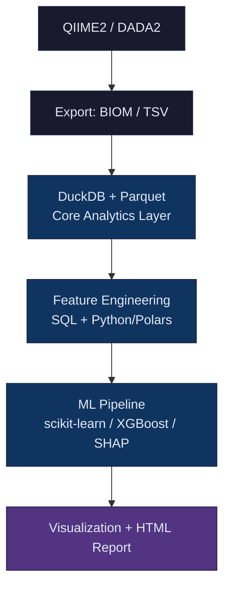

# FLORA

**Feature Learning and Omics Research Analytics**

A Python library for 16S rRNA amplicon microbiome analysis, combining QIIME2/DADA2 processing, DuckDB analytics, Polars-based feature engineering, and scikit-learn/XGBoost ML pipelines.

---

## Architecture



**Key design decisions:**

- DuckDB is the central query engine between ingestion and ML. All analytical joins, aggregations, and feature matrix generation happen via SQL.
- Polars handles high-performance tabular transformations.
- Parquet is the intermediate storage format. DuckDB reads Parquet directly without loading everything into memory.
- No file-based temp state leaks between pipeline stages.

---

## Installation

```bash
pip install flora-bio
```

For development:

```bash
git clone https://github.com/flora-bio/flora
cd flora
python3 -m venv venv
# Linux/macOS:
source venv/bin/activate
# Windows:
# venv\Scripts\activate
pip install -e ".[dev]"
```

Conda environment:

```bash
conda env create -f environment.yml
conda activate flora
```

---

## Quick Start

```python
from flora.pipelines import FLORAPipeline
from flora.ml import MicrobiomeClassifier
from flora.viz import plot_pcoa, plot_taxonomy_barplot
from flora.reports import FLORAReport

# Initialize pipeline (file-backed DuckDB)
pipeline = FLORAPipeline(workdir="results/")

# Ingest data
pipeline.ingest_metadata("data/raw/metadata.tsv")
pipeline.ingest_asv_table("data/raw/asv_table.tsv", wide_format=True)
pipeline.ingest_taxonomy("data/raw/taxonomy.tsv")

# Compute diversity
diversity = pipeline.compute_diversity(sampling_depth=10000)

# Get CLR-normalized feature matrix for ML
feature_matrix = pipeline.get_feature_matrix(normalize="clr", min_prevalence=0.1)

# ML: classification
from flora.db import FloraDB
db = pipeline.db

train_df, test_df = db.slice(
    train_filter="biome = 'Amazon'",
    test_filter="biome = 'Cerrado'",
    features="clr",
    target_column="biome",
)

clf = MicrobiomeClassifier(model="random_forest", target_column="biome")
result = clf.fit(train_df, test_df, cv_folds=5)
print(f"Accuracy: {result.accuracy:.4f}  F1-macro: {result.f1_macro:.4f}")

# Visualization
taxon_agg = db.aggregate_by_taxon(level="phylum", group_by="biome")
fig = plot_taxonomy_barplot(taxon_agg, level="phylum", group_by="biome")

# Report
report = FLORAReport(title="Amazonian Microbiome Analysis")
report.add_metrics("Pipeline Summary", {
    "Samples": len(feature_matrix),
    "ASVs": len(feature_matrix.columns) - 1,
    "Accuracy": f"{result.accuracy:.4f}",
})
report.add_plot("Taxonomic Composition", fig)
report.save("results/report.html")
```

---

## Web Interface

FLORA includes a browser-based dashboard for interactive analysis:

```bash
# Start the web interface
flora ui

# Custom host and port
flora ui --host 0.0.0.0 --port 9000 --workdir results/
```

The server opens at `http://127.0.0.1:8765` and provides:

- **Dashboard** — pipeline status, database stats, connection health
- **Data Acquisition** — download from MGnify or NCBI SRA
- **Feature Engineering** — CLR, TSS normalization, rarefaction, PCoA/UMAP
- **Machine Learning** — classification, regression, clustering with cross-validation
- **Visualizations** — interactive Plotly charts (taxonomy barplots, PCoA, alpha diversity)
- **Reports** — generate self-contained HTML reports

All endpoints are also available as a REST-like JSON API:

```bash
curl http://localhost:8765/api/status
```

See the [Web Interface documentation](docs/ui.md) for the full API reference.

---

## DuckDB Analytics Core

FloraDB exposes SQL over your data without loading it into memory:

```python
from flora.db import FloraDB

db = FloraDB.connect("results/flora.duckdb")

# Ad-hoc SQL
df = db.query("""
    SELECT t.phylum, AVG(a.abundance) AS mean_abundance, COUNT(DISTINCT a.sample_id) AS n_samples
    FROM asv a
    JOIN taxonomy t USING(feature_id)
    JOIN samples s USING(sample_id)
    WHERE s.biome = 'Amazon'
    GROUP BY t.phylum
    ORDER BY mean_abundance DESC
""").to_polars()

# High-level helpers
wide_matrix = db.pivot_asv(normalize="clr")
taxon_summary = db.aggregate_by_taxon(level="genus", group_by="biome")
train, test = db.slice("biome='Amazon'", "biome='Cerrado'", features="clr")
```

---

## Downloaders

```python
from flora.io import MGnifyDownloader, NCBISRADownloader

# MGnify
dl = MGnifyDownloader(biome="root:Environmental:Terrestrial:Forest")
manifest = dl.fetch("MGYS00005116", output_dir="data/raw", max_samples=80)

# NCBI SRA (requires sra-tools)
sra = NCBISRADownloader(n_jobs=4)
manifest = sra.fetch(["SRR12345678", "SRR12345679"], output_dir="data/raw")
```

Or via CLI with automatic DuckDB ingestion:

```bash
# Download and ingest into DuckDB
flora download mgnify MGYS00005116 --outdir data/raw --to-duckdb

# Download from SRA
flora download sra SRR12345678 SRR12345679 --outdir data/raw --jobs 4 --to-duckdb

# Ingest an existing download directory
flora ingest data/raw --duckdb-path results/flora.duckdb
```

---

## Feature Engineering

```python
from flora.feature_engineering import clr_transform, tss_transform, rarefy
from flora.feature_engineering import filter_by_prevalence, select_by_importance
from flora.feature_engineering import compute_pcoa, compute_umap

# Normalize
clr_df = clr_transform(wide_asv_df)
tss_df = tss_transform(wide_asv_df)
rarefied = rarefy(wide_asv_df, depth=10000)

# Filter
filtered = filter_by_prevalence(clr_df, min_prevalence=0.1)

# Dimensionality reduction
pcoa_df = compute_pcoa(tss_df, metric="braycurtis", n_components=3)
umap_df = compute_umap(clr_df, n_components=2)
```

---

## Machine Learning

```python
from flora.ml import MicrobiomeClassifier, MicrobiomeClusterer, MicrobiomeRegressor
from flora.ml import SHAPAnalyzer, HyperparameterTuner

# Classification
clf = MicrobiomeClassifier(model="xgboost", target_column="sample_type")
result = clf.fit(train_df, test_df, cv_folds=5)

# SHAP explanability
shap = SHAPAnalyzer(model=result.model, feature_names=result.feature_names)
shap_result = shap.explain(test_df)
fig = shap.summary_plot(shap_result)

# Hyperparameter tuning
tuner = HyperparameterTuner("random_forest", task="classification", n_trials=50)
best = tuner.tune(train_df)
clf2 = MicrobiomeClassifier(model_params=best.best_params)

# Clustering
clusterer = MicrobiomeClusterer(method="hdbscan")
clusters = clusterer.fit(pcoa_wide_df)

# Regression (diversity index prediction)
reg = MicrobiomeRegressor(model="random_forest", target_column="shannon")
reg_result = reg.fit(train_df, test_df)
```

---

## Testing

```bash
pytest tests/ -v --cov=flora --cov-report=html
```

All tests use DuckDB in-memory. No external files or services required.

---

## Supported Public Datasets

| Dataset      | Source   | Biome                   | Samples |
| ------------ | -------- | ----------------------- | ------- |
| MGYS00005116 | MGnify   | Amazonian Forest        | ~80     |
| SRP151124    | NCBI SRA | Brazilian Tropical Soil | ~60     |
| ERP009703    | MGnify   | Amazonian Rhizosphere   | ~120    |

---

## License

MIT. See [LICENSE](LICENSE).
