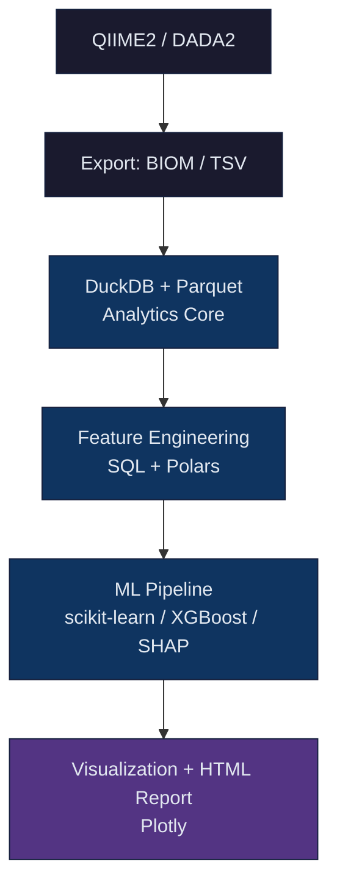

# FLORA Documentation

**Feature Learning and Omics Research Analytics**

Version 0.1.0 — Python library for 16S rRNA amplicon microbiome analysis.

---

## Contents

- [Installation](installation.md) — setup via pip, conda, or development mode
- [Quick Start](quickstart.md) — run the pipeline in five minutes
- [User Guide](user_guide.md) — complete reference for every module
- [Web Interface](ui.md) — browser-based dashboard for interactive analysis
- [Datasets](datasets.md) — supported public datasets and download instructions
- [Methods](methods.md) — scientific background for every algorithm used
- [Article](article.md) — full scientific article describing the project
- [Report](report.md) — technical project report

---

## What FLORA Does

FLORA provides an end-to-end workflow for microbiome data analysis:

1. Download raw sequencing data from MGnify, NCBI SRA, or the Earth Microbiome Project.
2. Validate FASTQ files, QIIME 2 manifests, and sample metadata.
3. Run QIIME 2 / DADA2 denoising and taxonomic classification.
4. Store all results in a DuckDB analytical database backed by Parquet files.
5. Apply compositionality-aware normalization (CLR, TSS, rarefaction).
6. Train classification, regression, and clustering models with built-in cross-validation.
7. Explain model decisions with SHAP values.
8. Generate self-contained interactive HTML reports.

---

## Architecture

---

## License

MIT. See [LICENSE](../LICENSE).
