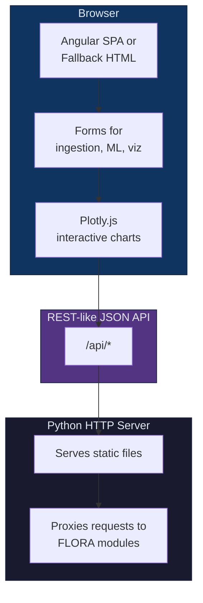

# Web Interface

FLORA includes a browser-based dashboard for interactive microbiome analysis.

---

## Quick start

```bash
# Start the web interface
flora ui

# Custom options
flora ui --host 0.0.0.0 --port 9000 --workdir results/ --no-browser
```

The server starts at `http://127.0.0.1:8765` and opens automatically in your default browser.

---

## Architecture

The web interface has two layers:



When the pre-built Angular frontend is available (`flora/front/dist/`), it is served as a modern SPA with Angular Material and Tailwind CSS. Otherwise, a lightweight built-in HTML interface is used.

---

## Pages

| Page | Route | Description |
|------|-------|-------------|
| **Dashboard** | `/dashboard` | Pipeline status, database stats, connection health |
| **Configuration** | `/config` | Adjust FloraConfig parameters and base paths |
| **Data Acquisition** | `/acquisition` | Download from MGnify or NCBI SRA |
| **Validation** | `/validation` | File integrity and schema compliance checks |
| **Ingestion** | `/ingestion` | Load ASV tables, taxonomy, and metadata into DuckDB |
| **Database Explorer** | `/explorer` | Read-only inspection of the star schema |
| **Feature Engineering** | `/features` | CLR, TSS normalization, rarefaction, PCoA/UMAP |
| **Diversity** | `/diversity` | Alpha diversity (Shannon, Richness) and beta distance |
| **Machine Learning** | `/ml` | Classification, regression, clustering |
| **Optimization** | `/optimization` | Bayesian hyperparameter search (Optuna) |
| **Evaluation** | `/evaluation` | Performance metrics, leak diagnostics |
| **Explainability** | `/explainability` | SHAP feature importance |
| **Visualizations** | `/visualizations` | Taxonomic composition, ordination, curves |
| **Reports** | `/reports` | Generate self-contained HTML reports |
| **Pipeline** | `/pipeline` | End-to-end orchestration view |

---

## API Endpoints

The server exposes a REST-like JSON API consumed by the frontend:

| Method | Endpoint | Description |
|--------|----------|-------------|
| `GET` | `/api/status` | Pipeline status and database stats |
| `POST` | `/api/ingest/metadata` | Ingest a metadata file |
| `POST` | `/api/ingest/asv` | Ingest an ASV table |
| `POST` | `/api/ingest/taxonomy` | Ingest a taxonomy file |
| `POST` | `/api/diversity` | Compute alpha diversity |
| `GET` | `/api/feature_matrix` | Get feature matrix (CLR/TSS/raw) |
| `POST` | `/api/ml/classify` | Train a classifier |
| `POST` | `/api/ml/cluster` | Run clustering |
| `GET` | `/api/viz/taxonomy` | Taxonomy barplot JSON |
| `GET` | `/api/viz/pcoa` | PCoA plot JSON |
| `GET` | `/api/viz/alpha` | Alpha diversity plot JSON |
| `POST` | `/api/download/mgnify` | Download from MGnify |
| `POST` | `/api/download/sra` | Download from NCBI SRA |
| `POST` | `/api/report` | Generate HTML report |

---

## Python API

You can also start the server programmatically:

```python
from flora.ui import run_server

run_server(host="127.0.0.1", port=8765, workdir="results/")
```

Or create the server and handler separately for integration with ASGI/WSGI frameworks:

```python
from flora.ui import create_app

httpd, handler, state = create_app(workdir="results/")
```

---

## Configuration

The web interface respects the same `FloraConfig` as the Python library:

```bash
# Use a custom config file
flora ui --config my_config.yaml

# Or set FLORA_CONFIG environment variable
export FLORA_CONFIG=/path/to/config.yaml
flora ui
```

---

## CLI reference

```
flora ui [OPTIONS]

Options:
  --host TEXT        Interface to bind to [default: 127.0.0.1]
  --port INTEGER     TCP port to listen on [default: 8765]
  --workdir PATH     Working directory for pipeline results [default: results/]
  --config PATH      Path to FloraConfig YAML file
  --no-browser       Do not open the browser automatically
```

---

## Dependencies

The web interface uses only Python standard library modules (`http.server`). No Flask, FastAPI, or other web framework is required.

Optional: the Angular frontend (`src/flora/front/`) provides a modern UI built with Angular 21, Angular Material, and Tailwind CSS 4. See [Frontend Development](../../src/flora/front/README.md) for build instructions.
